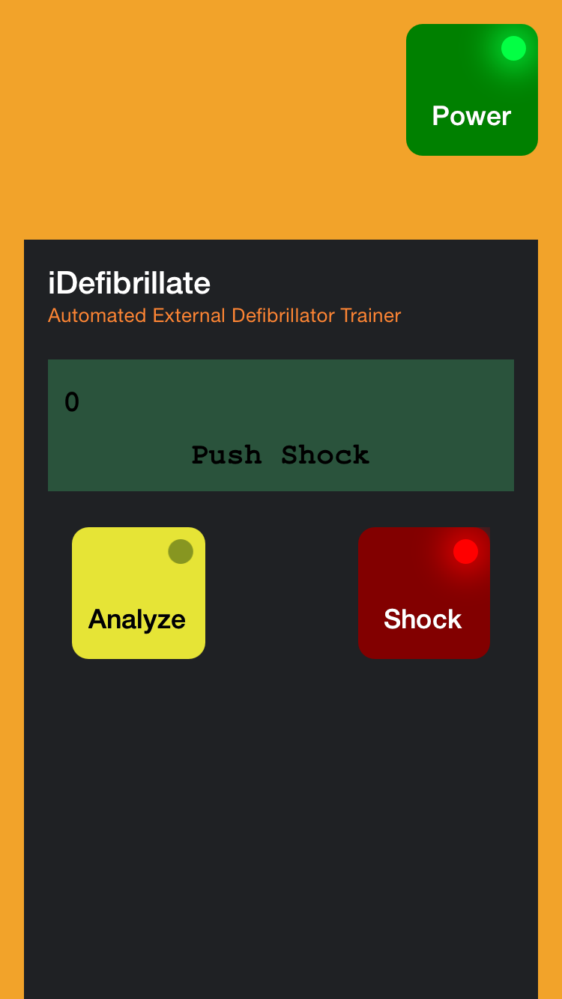

Realistic AED (Automatic External Defibrillator) simulator for iOS.

## Features

- Authentic simulation of an AED with realistic voice prompts, button clicks, sound effects, graphics, animations and flashing lights.
- Realistic two line LED display showing instructions, number of shocks and a two minute CPR countdown timer between analyzes.
- Scenario editor allows for custom or randomly generated scenarios.
- Adheres to 2010 and 2015 CPR Guidelines.
- Universal app support iPad and the latest iPhone 6/6+ models.
- Great price.

## Details

An AED is a device used to provide a shock of electricity to somebody in cardiac arrest (having a heart attack). It is the definitive treatment and knowing how to use one is an important skill for firefighters, EMTs, paramedics, nurses, doctors and with the prevalence of AEDs in public locations the general public.

This app is designed to give people a chance to see, hear and interact with an AED. If you have ever been curious as to how one operates now is your chance.

The built-in scenario editor lets you create a custom scenario or it can generate a random scenario for you. Combine an iPod Touch or iPhone, iDefibrillate and a pair of electrode pads and you've got an inexpensive realistic training environment for practicing CPR with AED without the need for costly AED trainers.

Designed and built by a former Canadian ambulance paramedic with 20 years of software development experience.

