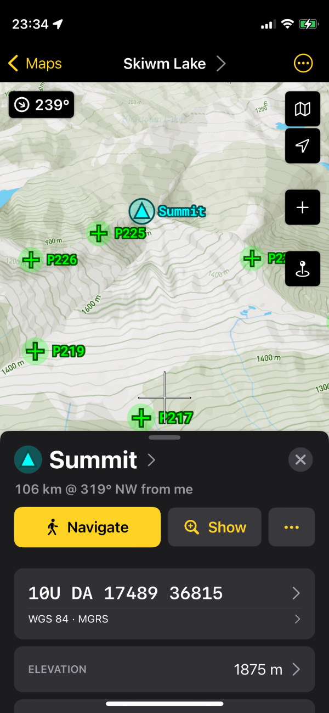

# {{ page.title }}

by [Gerry Shaw](/)

A land navigation GPS app built for professionals. No ads. Privacy respected.

- Offline maps
- 3D topographical and satellite maps
- Track recorder
- Customizable coordinate formats and units including MGRS and Mils
- Compass with inclinometer
- GPX import/export
- Document interface to organize map data
- No ads and no tracking
- Generous free tier, single in-app purchase to buy

[Land Nav Privacy Policy](/landnav/privacy)
