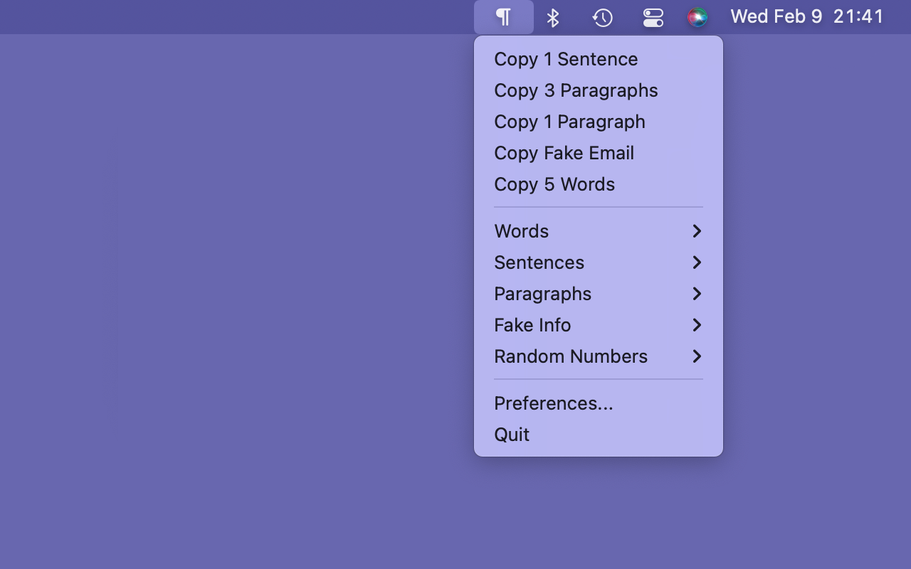

# {{ page.title }}

by [Gerry Shaw](/)

Latin text and other fake data generator for macOS. Lightweight, quick, completely free.

- Generates words, sentences, paragraphs, names, email, addresses, random numbers.
- Quick access to recently used generators.
- No ads and no tracking.

[Little Faker Privacy Policy](/littlefaker/privacy)
